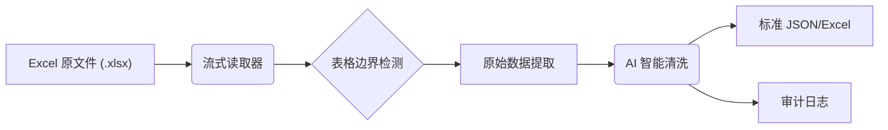

# ExcelDeepClean (智能 Excel 表格提取与清洗工具)

<div align="center">


[English](./README.md) | [中文](./README_zh-CN.md)

</div>

**ExcelDeepClean** 是一个将**复杂、非结构化的 Excel 报表**自动化转化为**高可用、数据库级结构化数据**的 AI 驱动工具。它结合了传统算法的高效性与大语言模型（LLM）的语义理解能力，完美解决合并单元格错位、多表混排、层级标题干扰等痛点。

---

## ✨ 核心优势

- **💡 智能语义分割**：利用 AI 自动识别“个案”、“索赔单”、“系统信息”等逻辑子表，无需人工配置复杂的切分规则。
- **🧩 完美处理合并单元格**：独创的流式解析算法，能够在读取时自动填充合并单元格的值，确保数据原子性。
- **🧹 深度数据清洗**：自动识别并剔除“新建”、“更改所有人”等仅供人机交互的操作按钮行。
- **⚡️ 极低资源占用**：采用流式读取 (Streaming) 技术，轻松处理 10w+ 行的大型 Excel 文件，内存占用极低。
- **📊 审计可追溯**：所有的 AI 清洗与切分操作都会生成详细的审计日志 (Audit Log)，拒绝黑盒操作。

## 🏗 架构流程



1.  **物理提取 (Extraction)**：
    *   直接解析 XML 实现合并单元格的“读取即填充”。
    *   基于连通域算法自动检测表格边界。
    *   自动修剪全空列。
2.  **智能清洗 (Refinement)**：
    *   **数据画像 (Data Profiling)**：生成列统计信息。
    *   **AI 决策 (AI Decision)**：调用 DeepSeek API 识别分节标题（Split）、噪声行（Delete）和冗余列（Merge）。
    *   **重组 (Reconstruction)**：重组数据并生成多 Sheet 的 Excel 报告。

## 🚀 快速开始

### 1. 安装依赖
本项目推荐使用 `uv` 进行包管理：
```bash
git clone https://github.com/zylar06/ExcelDeepClean.git
cd ExcelDeepClean
uv sync
```

### 2. 配置 API Key
在项目根目录创建 `.env` 文件，填入您的 LLM API Key（支持 OpenAI 格式，推荐 DeepSeek）：
```env
DEEPSEEK_API_KEY=sk-your-api-key-here
```

### 3. 运行命令

**步骤 1：初步提取 (Extract)**
将 Excel 文件转换为中间态 JSON：
```bash
uv run python -m excel_table_extractor extract test_data.xlsx -o output -f json
```

**步骤 2：AI 智能清洗 (Refine)**
调用 AI 对 JSON 进行深度清洗，并生成最终 Excel 报告：
```bash
uv run python -m excel_table_extractor process-json output/tables.json -o output/final_report.xlsx
```

---

## 🤝 贡献

欢迎提交 Issue 和 PR！

## 📄 许可证

MIT License
